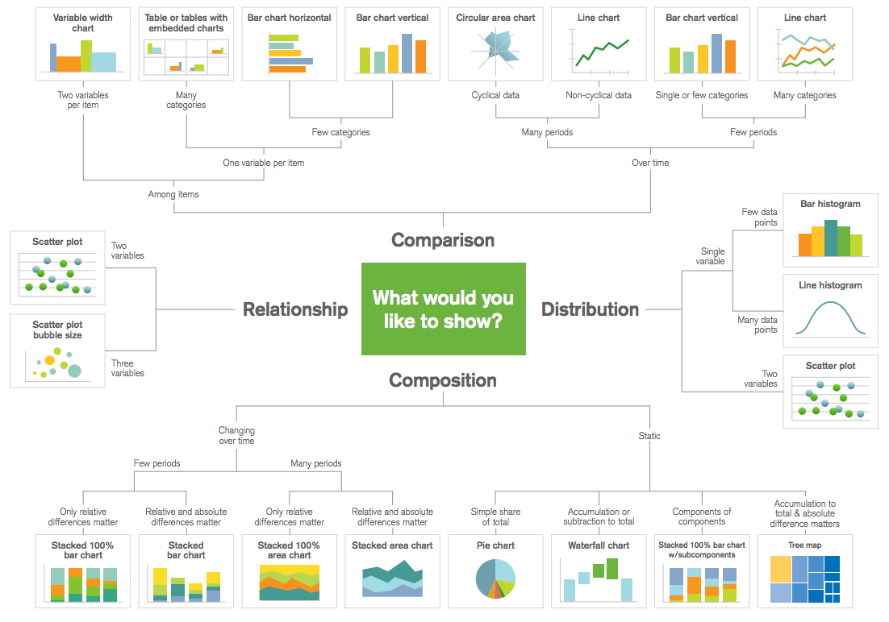
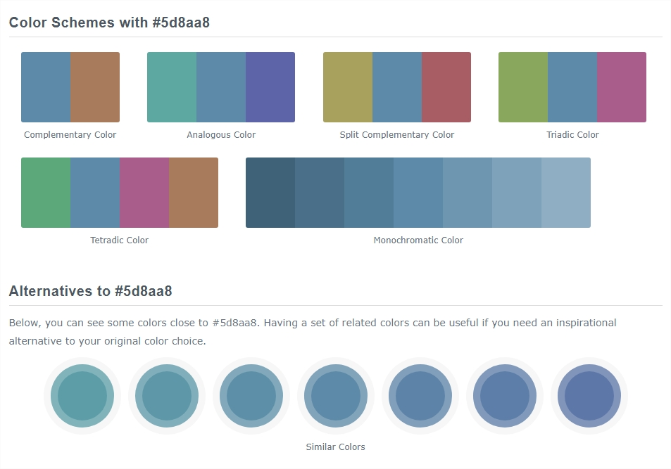

<p style="font-weight:600; font-size:36px">Power BI: from 0 to Ferrari</p>


<!-- TOC -->
<p style="font-weight:600; font-size:20px">Table of Contents</p>

- [Getting Data](#getting-data)
- [Clean and Transform](#clean-and-transform)
- [Data Modeling](#data-modeling)
  - [Data types, categories and format strings](#data-types-categories-and-format-strings)
  - [Power Query editor and the `M` language](#power-query-editor-and-the-m-language)
  - [Enhance your model with the Data View](#enhance-your-model-with-the-data-view)
  - [Create calculated columns](#create-calculated-columns)
  - [Create calculated measures](#create-calculated-measures)
  - [Create calculated tables](#create-calculated-tables)
  - [Relationships in the data model](#relationships-in-the-data-model)
- [Visualization and report design](#visualization-and-report-design)
  - [Editing interactions](#editing-interactions)
  - [Z-order](#z-order)
  - [What's the best chart for your data?](#whats-the-best-chart-for-your-data)
    - [Comparison](#comparison)
    - [Composition](#composition)
    - [Distribution](#distribution)
    - [Relationship](#relationship)
  - [Bookmarks](#bookmarks)
- [Data Analysis eXpressions (DAX)](#data-analysis-expressions-dax)
  - [Functions](#functions)
    - [Aggregations](#aggregations)
    - [Counting values](#counting-values)
    - [Relational functions](#relational-functions)
    - [Table-valued functions](#table-valued-functions)
  - [The IN operator](#the-in-operator)
  - [More functions](#more-functions)
  - [`CALCULATE ( )`](#calculate)
  - [Variables](#variables)
- [Evaluation contexts](#evaluation-contexts)
  - [Context transition](#context-transition)
- [Time Intelligence](#time-intelligence)
- [DAX Studio](#dax-studio)

<!-- /TOC -->

<div style="page-break-after: always;"></div>

## Getting Data

Connecting to a data source in Power BI is quite straightforward. Just navigate to the Home tab in the ribbon and select **Get Data** to find a dropdown menu of possible options. Common sources are SQL Server, Analysis Services, Excel and Dynamics 365, among others. In most cases, such as SQL Server, you can also specify the query you want to run against the database.
Note that when connecting to a source you can either query the data directly through **DirectQuery** or **Import** modes, but you cannot combine both methods into the same solution. There is also the **LiveConnection** mode, a variation of DirectQuery geared towards SSAS Tabular that we will not cover here.

There are some crucial differences between the two connection modes:
* In DirectQuery, the data stays at the source and is not imported into your machine's memory and the size of the `.pbix` file is dramatically lower than an import solution. However, each event during report visualization will trigger live queries that might harm the user experience. 
* In Import mode, the data model is loaded into Power BI desktop and remains static until a refresh is triggered. This makes for smooth user experience but increase file size and memory consumption.


When you have selected the source, Power BI will present you with a preview of your data. If everything looks OK, you can continue towards the next step. Otherwise, you can review your query and make any necessary changes.

You can also use a folder as your source, allowing you to import several files at once such as a series of Excel or CSV files. They are loaded as binary data types and double clicking them loads their values.

<div style="page-break-after: always;"></div>

## Clean and Transform

## Data Modeling

There some key aspects to take into account when modeling data with Power BI, such as data categories and summarization; or establishing adequate relationships among your tables. You can also create custom hierarchies such as Year/Month/Week or Country/Destination/Region by dragging dragging columns on top of each other in the Report or Data View.

### Data types, categories and format strings

There are several different types of data to work with in Power BI, such as integer, decimal/fixed, currency, date/time/datetime, string and binary objects.
The data type is what allows certain functions and operations to be performed on a specific column, and it's **not the same as the data format**.

The format string is the way that this data will be visually represented, such as percentage, with thousand separator, with decimals... There also many different formats for date and time objects which can also be changed flexibly with the DAX `FORMAT ( )` function.

Text data can be categorized, which is useful when you have geographical data or URLs in your table. Setting a data category for these columns allows for advanced features such as URL icons, embedded images and map visuals. Numerical data is uncategorized by default, since we use data types to differentiate it.
Both types of data need *summarization*, which is the default statistic that will be calculated by visuals using the measure. Possible options are `sum`, `average`, `minimum`, `maximum`, `count` and `distinct` for numerical types, while text types only have count and distinct. You can also use `first` and `last` within some visuals. 


It's important to make a distinction between modeling your data within the Power Query editor or within Power BI Desktop itself, since different operations can be performed and the computational load is different. Usually, we use the *Query Editor* to clean, shape and transform data from the source, while the *Data View* (i.e. Power Pivot) is often used to model the imported data and define calculations for analytics.

### Power Query editor and the `M` language

Power Query is a data discovery and query tool, good for shaping and mashing up data even before you’ve added the first row of data to the table. Inside the Power Query editor you can use the `M` programming language to shape your data, creating step by step scripts that iteratively clean, transform and add columns to your model.
Moreover, you can leverage the amazing Power BI user interface that makes this data engineering process very straight-forward and with zero necessary knowledge of `M`.

Some of the operations you can perform are:

* Duplicate, transform or split columns
  * You can use regular expressions, functions and calculations to engineer new features.
* Change data types and formats
  * Power Query can also detect automatically the best data type for your column if you are not sure.
* Pivot, unpivot and sort columns
* Merge (join) and append (union) queries
* Remove or keep duplicates, errors, nulls, headers...
* Group by columns and aggregate measures

### Enhance your model with the Data View

Not only can you explore all of your data interactively within this view, but you can also further improve the analytical capabilities of your model by using DAX expressions that leverage different filtering contexts and time frames to create complex features.

### Create calculated columns

You can create calculated columns, for example, to establish a relationship between different tables, or to create indexes that could later be used as reference by iterator functions.
Creating a calculated column consumes memory in your machine as it expands your data model if your tables have many records. Consider creating them only when necessary or for extremely complex calculations that should be run live.

Remember to custom sort your columns, i.e. `MonthName` should be sorted by `MonthNumber` and not alphabetically by itself.

### Create calculated measures

Measures are calculations that exists in your Power BI data model and is computed on the fly at each event. With DAX you can define a measure once and then slice it by all the different fields in your model, as long as the necessary relationships exist.

Since they are computed at query time, calculated measures consume more CPU than a column, but they do not grow the tables in your data model.

### Create calculated tables

Calculated tables allow you to express a whole new range of modeling capabilities, such as performing different types of joins and creating new tables on the fly based on the results of a formula.
For example, you can create a date dimension with DAX by using the date to derive all necessary attributes such as month, week number or day of the week, or create summary tables with aggregated values.

### Relationships in the data model

Data relationships are similar to how a cube is structured in Analysis Services. In the Model View you can access a diagrammatic view of your data, and you can define how your tables are related.
To create a relationship, just click on a column on your fact table and drag it into the key on the dimension table. This generates an arrow indicating the active relationship, which you can double click to access advanced options such as setting the cardinality or the direction of the relationship.

Your options for cardinality are Many to One, and One to One. Many to One is the fact to dimension type relationship, for example a sales table with multiple rows per product being matched up with a table listing products in their own unique row.

<div style="page-break-after: always;"></div>

## Visualization and report design

Visuals are the main element of Power BI reporting, and they have a wide range of formatting options that allows for almost limitless customization. 


### Editing interactions

When you have multiple visualizations on the same report page, selecting a particular segment by clicking or using a slicer will affect all the visuals on that page. In some cases, though, you may want to slice only specific visuals. For example, you might not want a scatter plot to be cross-filtered because that would remove crucial meaning from the visualization.
You can define how visuals interacts with each other when the user selects data points. 

### Z-order

When you have lots of elements on a report, Power BI lets you manage how they overlap with each other. How items are layered, or arranged on top of one another, is often referred to as the z-order.
This is particularly useful when you want to use shapes to create backgrounds, highlights or containers. For example, you might use a shape to create the background for your report title, or to enclose a set of KPIs in a container. You can also set a semi-transparent shape over a graph section to highlight it.

### What's the best chart for your data?

When designing a visualization, there are usually four main topics that the author would want to highlight:

#### Comparison

These are used to compare the magnitude of values to each other and to easily identify the lowest or highest values in the data.

If you want to compare values over time, line or bar charts are often the best option and their choice depends on the number of periods you would like to analyze.
However, for comparisons among items, bar or column charts are preferred. Line charts provide a sense of continuity that might not be meaningful for categories. Faceted charts are also a good option when dealing with many categories.
You can use pie charts for comparison as well, although the length of a column or bar is usually better at displaying differences in your data than the angle of a pie chart.

#### Composition

Composition charts are used to see how a part of your data compares to the whole, and can show relative and absolute values. They can be used to accurately represent both static and time-series data.

For static data, a pie chart can do the job. However, there also other options that can tell the same story, such as a stacked bar chart, a waterfall chart or a tree map.
For time-based data, the number of periods is again a decisive factor when choosing your chart. You can visualize composition over many periods with area charts, which are very similar to line charts, and stacked bar or column charts when you have a reduced amount of periods.
It is important to consider that time-based visualization should be ordered chronologically as a general rule, and not by highest value, for example.

#### Distribution

When studying how quantitative values are located along an axis, distribution charts are the way to go. By looking at the shape of the data, the user can identify features such as value range, central tendency and outliers.

With this charts, the interest is in the full picture of the data and this can lead to having many data points (note: not categories!). In these cases, it's often better to use a line histogram, while column histograms are great for few data points.
In any case, when analyzing distribution for two variables at once, a scatter plot allows to compare between the full picture of two dimensions.

#### Relationship

Relationship charts have a constrained set of options as normally scatter plots are the only adequate way of presenting the data. They are used to find correlations, outliers, and clusters in your data.

While the human eye can only appreciate three dimensions together, you can visualize additional variables by mapping them to the size, color or shape of your data points.


See the image below for reference:



<div style="page-break-after: always;"></div>

> As an bonus tool, if you run into issues trying to find the best set of colors for your report or chart, make sure to check out [ColorHex](https://www.colorhexa.com/). This is a web app that provides color scales, palettes and blends based on the color of your choice.
> 
> 
> 
> You can copy the hex or RGB code of any color and pass it directly to Power BI to generate your own palettes and themes.


### Bookmarks

Bookmarks are a great feature that allow for some nice tricks with user interaction. Essentially, a bookmark is a snapshot of your report page at a given time. They can save filter state, formatting options, visual placement, etc.
You can use them to change between report pages, create a guided navigation for the user, change themes, show help or filter panes, send emails and many more things. 

<div style="page-break-after: always;"></div>

## Data Analysis eXpressions (DAX)

DAX is a functional language, that is, execution flows from function calls read from inner to outer context in nested calls.

Here is a short description of DAX syntax conventions:

* Use [Measure] and 'Table'[Column] and never otherwise.
* Use spaces before opening and closing parentheses, and before any operand and operator.
* Space before an in-line argument, and indented line feed for multi-line function calls.

### Functions

#### Aggregations

* `SUM`, `AVERAGE`, `MIN`, `MAX`...
    * `SUM ( Sales[Price] )` works!
    * `SUM ( Sales[Price] + Sales[Quantity] )` does not!

Expressions within aggregators need to be calculated with an **iterator**. These are versions of the function with an X in their name, i.e. `SUMX`. These functions iterate over a table and evaluate the expression for every row, which means the concept of row context comes to life here.
These functions always receive two inputs: the table to iterate and expression to evaluate.

Note that `SUM` is just syntax sugar. `SUM ( Sales[Price] )` is translated in-engine to `SUMX ( Sales, Sales[Price] )`

#### Counting values

* `COUNT` /`COUNTA`: anything but blanks
* `COUNTBLANK`: blanks and empty strings 
* `COUNTROWS`: rows in a table
* `DISTINCTCOUNT`: syntax sugar for `COUNTROWS ( DISTINCT ( 'Table'[Column] ) )` 

#### Relational functions

* `RELATED` / `RELATEDTABLE`: both follow relationships in the data model and return the value of a column or all the rows in relationship with the current one.
    * All relationships must follow the same direction.

#### Table-valued functions

These return full tables which are often used as the input for further calculations.

You can mix table functions, for example: `FILTER ( ALL ( 'Sales' ); Product[Name] = "Hotel" )` puts a filter over the entire table, ignoring any other filter context.

* `FILTER`, `ALL`, `VALUES`, `DISTINCT`, `ADDCOLUMNS`, `SUMMARIZE`...
* `DISTINCT` returns the unique values of a column that are visible in the current context. 
* `VALUES` is the same, respects the filter context and returns the additional blank row if it's visible within the context. This row is created to guarantee referential integrity when values in the fact table can't be found in the dimension table.
* `ALL` returns all the rows of a table while ignoring every filter. It's useful to calculate grand totals and relative percentages.
* `ALLNOBLANKROW` is the same, but excludes the blank row.
* `ALLSELECTED` returns the elements of a table as visible outside the current visualization. That is, it ignores all filters from the current visual but respects all others.
    * Very dangerous function as it is difficult to debug.
* `ADDCOLUMNS` adds one or more columns to a table expression, keeping all existing columns. It's an iterator, so you can access columns of the table and perform expressions and calculations.

> ##### Quick tip!
> 
> I often use `ADDCOLUMNS` to generate a Date table, For example:
> 
> ```ruby
> ADDCOLUMNS (
>     ALL ( Sales[sk_Date] ); # the table that will be iterated
>     "Month"; # the name of the first column to add
>     MONTH ( [sk_Date] ); # the definition of the first column to add
>     "Year"; 
>     YEAR ( [sk_Date] ); 
>     ...
> )
> ```
> This is a very flexible way of generating your own date dimension according to your specific needs.
> 
> You can also generate a dimension table by scanning the columns of your different fact tables and appending them. For example:
> 
> ```ruby
> DISTINCT (
>     UNION (
>         ALL ( Transfer[BookingID] );
>         ALL ( Excursion[BookingID] );
>     )
> )
> ```

### The IN operator

Verifies whether a value exists in a list of possible values, i.e. `Company[Code] IN {"MTS", "OTS", "AXIS"}`.
Note that the curly brackets notation generates a temporary table behind the scenes to perform the filtering.

### More functions

* `DIVIDE ( )`: handles safe division by zero and allows for custom alternate values. No more `IF ( ISERROR (...) )`!
  * Also, better performance.
* `SELECTEDVALUE ( )`: provides a shortcut to access the filtered value of a dimension to display in a chart or card.
  * For example, you can create a custom measure that concatenates text with the selected value and display dynamic title in a chart.
  * Prior to this function, the same objective could be accomplished through something along the lines of `IF ( HASONEVALUE ( ... ) )`, which is much longer and error-prone.

### `CALCULATE ( )`

`CALCULATE` is the main function for DAX expressions, as it is used in many different scenarios to add, change or remove filters. Its syntax is as follows:

```ruby
CALCULATE (
    Expression;
    Filter1;
    ...;
    FilterN 
)
```

`CALCULATE ` calls with multiple filters can have very different behaviors:

```ruby
CALCULATE (
    SUM ( Bookings[Items] );
    Company[Code] IN {"MTS", "OTS"};
    Date[Year] = 2019
)
```
This will result in the amount of booking items for the filtered companies, in 2019.
However, the following expression has a very different result:

```ruby
CALCULATE (
    CALCULATE (
        SUM ( Bookings[Items] );
        Company[Code] IN {"MTS", "OTS"};
    );
    Company[Code] IN {"MTS", "AXIS"}
)
```
In this case, the use of nested `CALCULATE` statements does not intersect the filter. The result of the expression is **the amount of items only for MTS**, since the inner filter overwrites the outer.

<div style="page-break-after: always;"></div>

You can override this behavior to intersect filter by using the `KEEPFILTERS` function:

```ruby
CALCULATE (
    CALCULATE (
        SUM ( Bookings[Items] );
        KEEPFILTERS ( Company[Code] IN {"MTS", "OTS"} );
    );
    Company[Code] IN {"MTS", "AXIS"}
)
```

In this context, only MTS remains visible at the end of the evaluation.


### Variables

Newer feature in DAX. Allows for reduced repetition of expressions and other nifty tricks, such as accessing outer row context.
You can store strings, numbers, and even tables in a variable.

Variables can be used to store the previous row context for later access:

```ruby
Product[Rank] =
VAR _CurrentPrice = Product[Price]

RETURN

COUNTROWS (
    FILTER(
        Product;
        Product[Price] > _CurrentPrice
    )
) + 1
```

In this case, you save the value of the previous price during the outer context evaluation, an use it to check whether the price in the inner context is greater.

<div style="page-break-after: always;"></div>

## Evaluation contexts

The filter and row contexts are one of the most important concepts in DAX.

The filter context is defined by:
* row selection
* column selection
* report filters
* slicer selection


The row context is the concept of "current row" and you have a row context whenever you iterate a table, either explicitly (using an iterator) or implicitly (in a calculated column).

>  
> ##### Quick tip!
> 
> Starting from a row context, you can use related to access columns in other tables:
> 
> ```ruby
> SalePrice =
> 
> SUMX (
>     Bookings;
>     Bookings[Cost] * RELATED ( Product[Markup] )
> )
> ```
> You need RELATED because the row context is iterating the sales table. The Markup columns is in another table, but the row context allows for the relationship to be propagated. 
> 
> 
> ```ruby
> AverageDiscountedIncomeByProduct =
> 
> AVERAGEX (
>     Products;
>     SUMX (
>         RELATEDTABLE ( Bookings );
>         Bookings[Income] * Products[Discount]
>     )
> )
> 
> ```

The inner expression can safely reference two columns coming from different tables because there are **two row contexts**: the first one introduced by `AVERAGEX` and the second one by `SUMX`. Also note that `RELATEDTABLE` uses the row context to determine the set of rows to return, that is, the bookings of the current product which is the one being currently iterated by `AVERAGEX`.

<div style="page-break-after: always;"></div>

### Context transition

The context transition in DAX is the transformation of row contexts into an equivalent filter context performed by `CALCULATE` functions.
When `CALCULATE` is executed within a row context, it transforms the context into the equivalent filter context and applies it to the data model before computing its expression.
This is an expensive operation, so it's better to avoid it when iterating large tables.

This concept is easier to understand through examples:

```ruby
Product[SumInsertedRecords] = SUM ( ScrapingLog[InsertedRecords] )
Product[SumInsertedRecordsCalc] = CALCULATE ( SUM ( ScrapingLog[InsertedRecords] ) )
```

The first calculated column returns the grand total of `Sales[Quantity]`, because no filter context is active, whereas the one with `CALCULATE` returns the sum of `Sales[Quantity]` for the current product only, because the filter context containing the current product is automatically propagated to sales due to the relationship between the two tables.

It is important to note that context transition happens before further filters in `CALCULATE`. Thus, filters in `CALCULATE` might override filters produced by context transition as seen on previous sections.

<div style="page-break-after: always;"></div>

## Time Intelligence

Time intelligence manages complex time-based calculations with reduced user input. It needs a date table with no date gaps, which Power BI creates automagically if the setting `Auto Date/Time` is enabled, which is the default case.
It is recommended to create your own date table instead of relying on this one, since it's not possible to adjust if necessary and can actually only be viewed from DAX Studio.

If you decide to work with it, you can use dot notation to access the time calculations, i.e. `Bookings[Booking Date].[Date]`.


## DAX Studio 

DAX Studio is a tool to write, execute, and analyze DAX queries in Power BI, Power Pivot for Excel, and Analysis Services Tabular. It can connect to any of sources and access their data model, such as an open Power BI file.

It includes an Object Browser, query editing and execution, formula and measure editing, syntax highlighting and formatting, integrated tracing and query execution breakdowns.

This tool supercharges you report development toolbelt and allows to access fairly advanced features such as:

* Query tracing and server timings: provides insights on execution time, and differentiates between time spent on formula or query engine to facilitate debugging.
* Filter dumps: you can create a measure automatically that shows the current filter context for each visual and data point. This filter dump can be set on a tooltip to make debugging infinitely easier.
* Measure definitions: similarly, you can automatically document all of your calculated measures with a single click inside of DAX Studio.
* Language formatting: you can also format your DAX queries using the syntax tree developed by SQLBI and used in [DAX Formatter](https://www.daxformatter.com/).
* Dynamic Management Views (DMVs): the tool also grants access to several pre-defined DMVs that allow for finer control of the data model embedded in the file.

